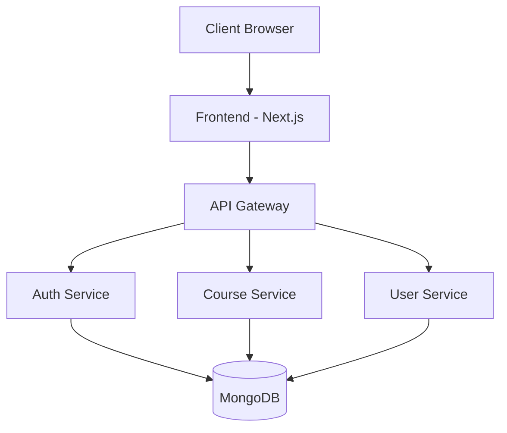

# System Architecture

## Overview
The LMS is built using a modern microservices architecture with clear separation of concerns between frontend and backend components.

## Architecture Diagram


## Components

### Frontend Layer
- Next.js application
- Server-side rendering
- Client-side state management
- UI component library

### API Gateway
- Request routing
- Authentication middleware
- Rate limiting
- Request/Response transformation

### Service Layer
1. Authentication Service
   - User authentication
   - JWT management
   - Session handling

2. Course Service
   - Course management
   - Content delivery
   - Progress tracking

3. User Service
   - User management
   - Profile handling
   - Role management

### Data Layer
- MongoDB database
- Data models
- Indexing strategy
- Backup system

## Security Architecture
- JWT-based authentication
- Role-based access control
- Input validation
- XSS protection
- CSRF protection

## Scalability
- Horizontal scaling capability
- Load balancing
- Caching strategy
- Database optimization

## Monitoring
- Performance metrics
- Error tracking
- User analytics
- System health monitoring

## Tech Stack
### Frontend
- Next.js (React framework)
- Redux Toolkit for state management
- Tailwind CSS for styling
- Axios for API requests

### Backend
- Node.js with Express.js
- MongoDB with Mongoose
- JWT for authentication
- Bcrypt for password hashing

### Storage & Services
- Cloudinary for video/file storage
- Nodemailer for email services
- MongoDB Atlas for database hosting

## System Components

### 1. Authentication System
- JWT-based authentication
- Role-based access control (Admin, Instructor, Student)
- Protected route middleware

### 2. User Management
- User roles and permissions
- Profile management
- Enrollment tracking

### 3. Course Management
- Course CRUD operations
- Lesson organization
- Content delivery system

### 4. Learning System
- Video lesson delivery
- Quiz management
- Progress tracking
- Certificate generation

### 5. Database Schema

#### User Model
```typescript
{
  name: string
  email: string
  password: string
  role: enum['admin', 'instructor', 'student']
  enrolledCourses: [CourseId]
  completedLessons: [LessonId]
  certificates: [CertificateId]
}
```

#### Course Model
```typescript
{
  title: string
  description: string
  instructorId: UserId
  lessons: [LessonId]
  enrolledStudents: [UserId]
  createdAt: Date
  updatedAt: Date
}
```

#### Lesson Model
```typescript
{
  title: string
  courseId: CourseId
  videoUrl: string
  content: string
  quizId: QuizId
  order: number
}
```

#### Quiz Model
```typescript
{
  lessonId: LessonId
  questions: [{
    question: string
    options: [string]
    correctAnswer: number
  }]
  timeLimit: number
}
```

#### Submission Model
```typescript
{
  studentId: UserId
  quizId: QuizId
  answers: [number]
  score: number
  submittedAt: Date
}
```

## API Structure

### Authentication Routes
- POST /api/auth/register
- POST /api/auth/login
- GET /api/auth/me

### User Routes
- GET /api/users
- GET /api/users/:id
- PUT /api/users/:id
- DELETE /api/users/:id

### Course Routes
- GET /api/courses
- POST /api/courses
- GET /api/courses/:id
- PUT /api/courses/:id
- DELETE /api/courses/:id

### Lesson Routes
- GET /api/lessons
- POST /api/lessons
- GET /api/lessons/:id
- PUT /api/lessons/:id
- DELETE /api/lessons/:id

### Quiz Routes
- GET /api/quizzes
- POST /api/quizzes
- GET /api/quizzes/:id
- PUT /api/quizzes/:id
- POST /api/quizzes/:id/submit 